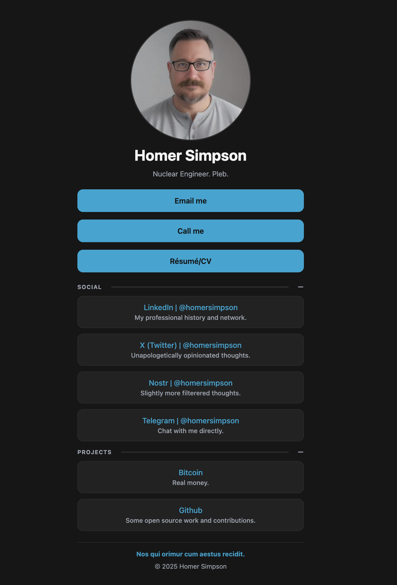

# OwnTree

OwnTree is a self-hosted, static alternative to Linktree. Point your audience to one clean page that you control, with zero analytics scripts or vendor lock-in.



## Highlights
- Static assets only (`index.html`, `config.json`, `styles.css`, `main.js`); no build step required.
- Privacy-first: ships without trackers, pixels, or external analytics.
- Config-driven layout that keeps your links, socials, and calls-to-action in one portable file.
- Deploy anywhere that can serve static files—GitHub Pages, Nginx, S3, Cloudflare Pages, Netlify, FTP, you name it.

## Quick Start
1. Clone the repo: `git clone https://github.com/yourname/owntree && cd owntree`.
2. Edit `config.json` (or keep your links inline in `index.html` if you prefer) to match your profile.
3. Preview locally with a simple server (`python3 -m http.server 8000`) so the browser can fetch `config.json`.
4. Deploy the static files to your host of choice.

## Configuration
All copy, links, and metadata are driven by `config.json`. The structure is intentionally straightforward:

```json
{
  "theme": "dark",
  "identity": {
    "name": "Your Name",
    "tagline": "What you do",
    "avatar": "assets/avatar.png"
  },
  "meta": {
    "title": "Page title",
    "description": "Short page description",
    "ogImage": "assets/share.png"
  },
  "primaryActions": [
    { "label": "Email me", "url": "mailto:you@example.com" },
    { "label": "Call me", "url": "tel:+1234567890" }
  ],
  "linkGroups": [
    {
      "title": "Social",
      "links": [
        {
          "label": "LinkedIn | @you",
          "url": "https://linkedin.com/in/you",
          "subtext": "Quick context for the link"
        }
      ]
    }
  ],
  "footer": {
    "message": "Optional footer note",
    "message_link": "https://example.com",
    "copyright": "© 2025 You"
  }
}
```

- **Meta tags**: Populate `meta` so your page unfurls nicely on social platforms.
- **Primary actions**: Surface your most important CTAs at the top (email, call, booking link, etc.).
- **Link groups**: Organize socials, projects, or resources into collapsible sections.
- **Footer**: Add a sign-off or legal copy. External links open in a new tab automatically.

> Prefer editing inline? You can hardcode links in `index.html`, but `config.json` keeps things tidy and reusable.

## Theming & Layout
- Update the color palette, typography, and spacing tokens at the top of `styles.css`.
- Swap the avatar image in `assets/` with your own file, keeping the same path or updating `config.json`.
- Extend styles by adding new utility classes or overriding the existing `.btn`, `.link-group`, etc.
- Want light and dark variants? Duplicate the `:root` token block and set `body[data-theme="light"]` overrides, then toggle via the `theme` value in `config.json`.

## Local Development Tips
- Always serve the directory via HTTP—loading `index.html` directly from the filesystem blocks the `fetch('config.json')` call because of browser security rules.
- Validate any JSON edits to avoid silent failures (`jq . config.json` is handy).
- Console logs show up in DevTools if `config.json` fails to load.

## Deployment Options
- **GitHub Pages**: Push to `main`, enable Pages on the repo, and point it at `main` /root.
- **Static hosts**: Drag the folder to Netlify, Cloudflare Pages, Vercel (static export), Render, etc.
- **Traditional hosting**: Drop the files into your Nginx/Apache document root or upload to S3/CloudFront.
- **Custom domains**: Configure DNS (CNAME/A records) at your registrar to map your domain to the host.

No matter the host, you only need to upload the four files plus any assets referenced in `config.json`.

## FAQ
- **Can I add analytics?** Yes—drop your own script tag in `index.html`. By default nothing ships.
- **Can I embed video or other widgets?** Absolutely. Extend `main.js` to render richer elements or embed components directly in `index.html`.
- **How do I add more sections?** Add new objects to `linkGroups` or create additional containers in the markup and hydrate them in `main.js`.

## License
MIT — do whatever you like, just keep the license file intact.
